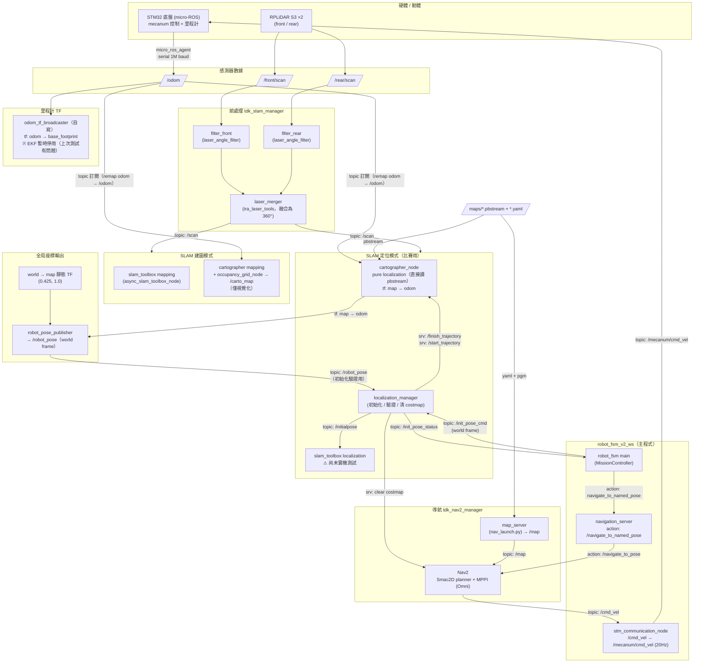
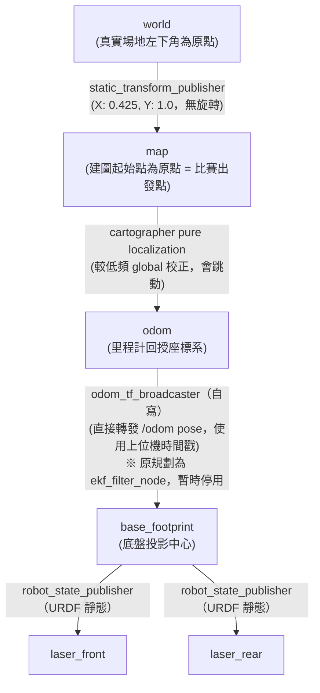

# TDK 30th — tdk_slam_ws（定位與導航）

TDK 30 屆競賽機器人的**定位 + 導航** workspace，與主程式 [`robot_fsm_v2_ws`](https://github.com/terryking0711/robot_fsm_v2_ws) 搭配運作：本 ws 負責感測器前處理、SLAM 定位、TF 樹與 Nav2 導航；FSM ws 負責任務決策並透過 topic / action 呼叫本 ws 的服務。

- 分支：`tmep_ver`（實機用）
- 環境：ROS2 Humble + Docker（`docker/`），CycloneDDS，`ROS_DOMAIN_ID=30`

---

## 整體系統架構（跨兩個 workspace）



---

## TF Tree（實機）



---

## 套件結構

| 套件 | 內容 |
|------|------|
| `tdk_slam_manager` | 自寫節點（`odom_tf_broadcaster`、`laser_angle_filter`、`robot_pose_publisher`、`localization_manager`）、cartographer / slam_toolbox / EKF 設定檔、URDF、地圖、`spawn_launch.py` |
| `tdk_nav2_manager` | Nav2 參數（MPPI / DWB / Smac / ThetaStar 多組可切換）、costmap 設定、behavior tree、`nav_launch.py`（含 map_server） |
| `rplidar_ros` | RPLiDAR S3 驅動（vendored） |
| `ira_laser_tools` | 雙 LiDAR 融合（submodule，nakai-omer humble fork） |

## localization_mode（`spawn_launch.py` 啟動參數）

| mode | 用途 | 狀態 |
|------|------|------|
| `mapping` | slam_toolbox 建圖 | ✅ 可用 |
| `carto_mapping` | cartographer 建圖（`/carto_map` 視覺化） | ✅ 可用 |
| `cartographer` | **比賽主定位**：pure localization 讀 pbstream | ✅ 實機測試中 |
| `slam_toolbox` | slam_toolbox 定位 | ⚠ 尚未測試 |
| `amcl` | AMCL 定位（備援） | ⚠ 尚未測試 |

## 啟動流程（實機）

```bash
# Terminal 1 — 連線到 micro-ROS agent（連 STM32，1M baud）/microros_ws
cd microros_ws/
source install/setup.bash
ros2 run micro_ros_agent micro_ros_agent serial --dev /dev/ttyACM0 -v6 --baudrate 1000000

# Terminal 2 — scan + TF + 定位
ros2 launch tdk_slam_manager spawn_launch.py localization_mode:=cartographer

# Terminal 3 — Nav2 + map_server
ros2 launch tdk_nav2_manager nav_launch.py

# Terminal 4 — 主程式（於 robot_fsm_v2_ws）
ros2 run robot_fsm robot_fsm_main
```

---

## 目前進度

- ✅ 雙 LiDAR 驅動 + 角度濾波 + 360° 融合 pipeline
- ✅ STM32 micro-ROS `/odom` → `odom_tf_broadcaster` 發布 `odom→base_footprint` TF
- ✅ Cartographer 建圖與 pure localization（pbstream），實機地圖 `real_map_0` 已建立
- ✅ `localization_manager`：接收 FSM `/init_pose_cmd`（world frame），透過 `/finish_trajectory` + `/start_trajectory` 重設 cartographer 軌跡，以 `/robot_pose` 驗證（容差 0.15 m / 0.15 rad），成功後清除 Nav2 costmap 並回報 `/init_pose_status`
- ✅ `world→map` 靜態 TF（0.425, 1.0）+ `robot_pose_publisher` 輸出場地全局座標
- ✅ Nav2：Smac2D + MPPI（Omni，mecanum 適用），map_server 獨立 lifecycle manager

## 未完成 / 已知問題

- ❌ **EKF（robot_localization）停用中**：上次實機測試有問題（`/odometry/filtered` 異常），暫以自寫 `odom_tf_broadcaster` 取代；IMU 融合連帶未接入，`ekf_config.yaml` 保留待修
- ❌ **slam_toolbox 定位模式未測試**（launch 與 `localization_manager` 的 `/initialpose` 介面已寫好）
- ⬜ 比賽場地正式地圖尚未重建（目前為練習場地 `real_map_0`）
